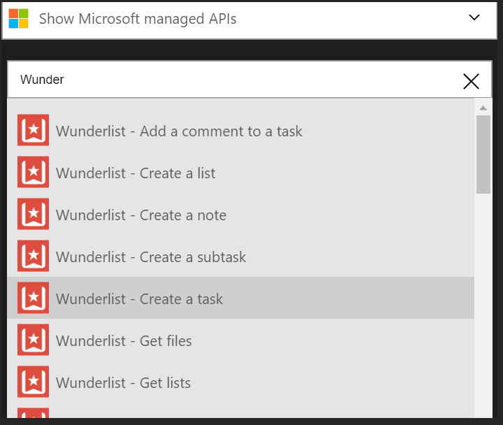

### 必要條件
- Wunderlist 帳戶  

您可以使用 Wunderlist 帳戶中的邏輯應用程式之前，您必須授權邏輯應用程式連線至 Wunderlist 帳戶。 所幸，您可以輕鬆從 Azure 入口網站上邏輯應用程式中。 

以下是授權邏輯應用程式連線到您 Wunderlist 帳戶步驟︰

1. 若要建立的連線，Wunderlist，邏輯應用程式設計工具] 中，選取下拉式清單中的 [**顯示 Microsoft 受管理的 Api** ，然後在 [搜尋] 方塊中輸入*Wunderlist* 。 選取您要使用的巨集指令的觸發程序︰  
  
2. 如果您還沒有建立任何連線到 Wunderlist 之前，您會提供您 Wunderlist 認證提示。 這些認證會用於授權邏輯應用程式連線至，並存取 Wunderlist 帳戶的資料︰   
    
2. 提供您的認證，然後選取 [登入] 按鈕  
    
3. 您會然後會說什麼邏輯應用程式必須對 Wunderlist 帳戶權限。 如果您同意的話，選取 [] 按鈕，表示您的合約。 
    
4. 最後，請選取 [**授權**] 按鈕  
    

