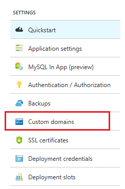

已傳播的記錄您的網域名稱之後，您必須將其關聯 Web 應用程式。 您可以使用下列步驟來啟用使用網頁瀏覽器的網域名稱。

> [AZURE.NOTE] 它需要一些時間在先前的步驟，透過 DNS 系統散佈中建立的 TXT 記錄。 您無法到您的 web 應用程式新增的網域名稱，直到散佈的 TXT 記錄。 如果您使用的 A 記錄，您無法將新增 A 記錄的網域名稱至您的 web 應用程式鍵，直到散佈在先前的步驟建立 TXT 記錄。
>
> 您可以使用的服務，例如<a href="http://www.digwebinterface.com/">http://www.digwebinterface.com/</a>確認 TXT 記錄可以使用。

1. 在瀏覽器中開啟[Azure 入口網站](https://portal.azure.com)。

2. 在 [ **Web 應用程式**] 索引標籤中，按一下您的 web 應用程式的名稱，然後選取**自訂網域**

    

3. 在**自訂網域**刀中，按一下 [**新增主機名稱**]。
    
4. 您可以使用 [**主機名稱**] 文字方塊，輸入此 web 應用程式與相關的網域名稱。

    

6.  按一下 [**驗證**]。

7.  在 [**驗證**Azure 會開始進行網域驗證工作流程。 這會檢查網域擁有權，以及 Hostname 可用性和報表成功或使用規定 guidence 如何修正錯誤詳細的錯誤。    

此時，您應該可以在瀏覽器中輸入自訂的網域名稱，並查看，其已成功會帶您到您的 web 應用程式。
