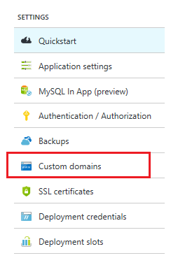
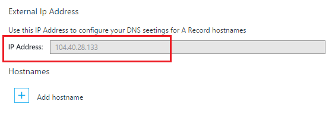

網域名稱系統 (DNS) 用來在網際網路上尋找資源。 例如，當您在瀏覽器中輸入網址應用程式，或按一下網頁上的連結，它會使用 DNS 將 IP 位址翻譯網域。 IP 位址就像街道地址，但不是非常人類易記。 例如，則更容易記住的 IP 位址，例如 192.168.1.88 或 2001:0:4137:1f67:24a2:3888:9cce:fea3 大於記住 DNS 名稱 （例如**contoso.com）** 。

DNS 系統會根據*記錄*。 記錄會特定*名稱*，例如**contoso.com**，關聯的 IP 位址或另一個 DNS 名稱。 時，請在應用程式，例如網頁瀏覽器中，尋找 DNS 中的名稱，它會找到記錄時，並使用上述程序指向為地址。 如果 IP 位址指向的值，在瀏覽器會使用該值。 如果它指向其他 DNS 名稱時，應用程式必須再次執行解析度。 最後，所有名稱解析會都結尾的 IP 位址。

當您在應用程式服務建立 web 應用程式時，則 DNS 名稱會自動指派到 web 應用程式中。 此名稱的格式為**&lt;yourwebappname&gt;。 azurewebsites.net**。 還有虛擬的 IP 位址可供使用時建立 DNS 記錄，您可以建立指向的記錄，以便**。 azurewebsites.net**，或您可以指向的 IP 位址。

> [AZURE.NOTE] 如果您要刪除和重新建立 web 應用程式，或變更**免費**應用程式服務方案模式以**基本**]、 [**共用**] 或 [**標準**設定之後，就會變更您的 web 應用程式的 IP 位址。

也有多種類型的記錄，兩者都有自己的功能和限制，但是 web 應用程式只能重要兩個， *A*與*CNAME*記錄。

###地址的記錄 （A 記錄））

例如 A 記錄對應的網域，例如**contoso.com**或**www.contoso.com**，*或萬用字元網域* ** \*。 contoso.com**，IP 位址。 如果在應用程式服務的 web 應用程式，虛擬服務的 IP 或特定 IP 地址您購買 web 應用程式。

上一筆 CNAME 記錄 A 記錄的主要優點是︰

* 您可以將根網域，例如**contoso.com**對應到 IP 位址。許多註冊機構上只允許此使用記錄

* 您可以讓項目，例如使用萬用字元， ** \*。 contoso.com**，其會處理多個子網域，例如**mail.contoso.com**、 **blogs.contoso.com**或**www.contso.com**的要求。

> [AZURE.NOTE] A 記錄] 已對應至的靜態 IP 位址，因為其無法自動解析變更您的 web 應用程式的 IP 位址。 當您設定自訂網域名稱設定 web 應用程式; 提供記錄搭配使用的 IP 位址不過，如果您要刪除和重新建立 web 應用程式，或變更回**免費**的應用程式服務方案模式，可能會變更這個值。

###Alias （別名） 記錄 （CNAME 記錄）

CNAME 記錄會將*特定*DNS 名稱，例如**mail.contoso.com**或**www.contoso.com**，對應到另一個 （標準） 的網域名稱。 在應用程式服務 Web 應用程式，是標準的網域名稱**&lt;yourwebappname >。 azurewebsites.net** web 應用程式的網域名稱。 CNAME 建立後，建立一個別名**&lt;yourwebappname >。 azurewebsites.net**網域名稱。 CNAME 項目會解析為的 IP 位址您**&lt;yourwebappname >。 azurewebsites.net**網域名稱，如果 web 應用程式的 IP 位址變更，您不必採取任何動作。

> [AZURE.NOTE] 一些網域註冊機構只允許您將對應的子網域時使用 CNAME 記錄，例如**www.contoso.com**，並不根名稱，例如**contoso.com**。 如需有關 CNAME 記錄的詳細資訊，請參閱提供您的註冊機構、<a href="http://en.wikipedia.org/wiki/CNAME_record">維基百科上的項目 CNAME 記錄</a>時或<a href="http://tools.ietf.org/html/rfc1035">IETF 網域名稱-實作與規格</a>文件的文件。

###Web 應用程式 DNS 細節

使用 Web 應用程式的 A 記錄會要求您先建立一個的下列 TXT 記錄︰

* **根網域**的 DNS TXT 記錄**@**至**&lt;yourwebappname&gt;。 azurewebsites.net**。

* **為特定的子網域**的 DNS 名稱**&lt;的子網域 >**至**&lt;yourwebappname&gt;。 azurewebsites.net**。 例如，**部落格** **blogs.contoso.com**A 記錄是否。

* **萬用字元 sub dodmains 的**DNS TXT 記錄 * * * 若要**&lt;yourwebappname&gt;。 azurewebsites.net**。

此 TXT 記錄會用於驗證您擁有您想要使用的網域。 這是除了建立 A 記錄指向您的 web app 的虛擬 IP 位址。

您可以找到的 IP 位址和**。 azurewebsites.net**名稱 web 應用程式，執行下列步驟︰

1. 在瀏覽器中開啟[Azure 入口網站](https://portal.azure.com)。

2. 在**Web 應用程式**刀中，按一下您的 web 應用程式的名稱，然後選取**自訂網域**從頁面底部。

    

3. 在**自訂網域**刀中，您會看到的虛擬的 IP 位址。 儲存此資訊，請將會用於時建立 DNS 記錄

    

    > [AZURE.NOTE] 您無法以**釋放**web 應用程式中，使用自訂網域名稱，而且必須**共用**、**基本**、**標準**、 或**進階版**層升級的應用程式服務方案。 如需詳細資訊，應用程式服務方案的價格層級，包括如何變更您的 web 應用程式的價格層，請參閱[如何擴充 web 應用程式](../articles/web-sites-scale.md)。
