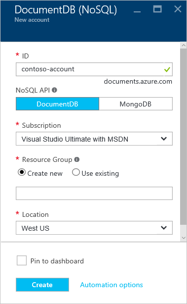

1.  [Azure 入口網站](https://portal.azure.com/)登入。
2.  在 Jumpbar，按一下 [**新增**]，按一下 [**資料 + 的儲存空間**]，然後按一下**DocumentDB (NoSQL)**。

    ![Azure 入口網站，並醒目提示 [更多服務]，然後 DocumentDB (NoSQL) 的螢幕擷取畫面](./media/documentdb-create-dbaccount/create-nosql-db-databases-json-tutorial-1.png)  

3. 在**新帳戶**刀中，指定 DocumentDB 帳戶所需的設定。

    

    - 在 [**識別碼**] 方塊中，輸入名稱來識別 DocumentDB 帳戶。  當**ID**驗證時，綠色的核取記號會出現在 [**識別碼**] 方塊中。 [**識別碼**] 的值會變成 URI 內，主機名稱。 **識別碼**可能包含只大小寫字母、 數字，以及 '-' 字元，而且必須是介於 3 至 50 個字元。 附註的*documents.azure.com*會附加您選擇，結果會為您 DocumentDB 帳戶端點結束點名稱。

    - 在 [ **NoSQL API** ] 方塊中，選取**DocumentDB**。  

    - [**訂閱**]，選取您想要使用的 DocumentDB 帳戶 Azure 訂閱。 如果您的帳戶有只有一個訂閱，預設會選取該帳戶。

    - 在 [**資源] 群組**中，選取或建立您的 DocumentDB 帳戶的資源群組。  根據預設，會建立新的資源群組。 如需詳細資訊，請參閱[使用 Azure 入口網站管理 Azure 資源](../articles/azure-portal/resource-group-portal.md)。

    - 若要指定要主控您的 DocumentDB 帳戶的地理位置的使用**位置**。 

4.  一旦設定新的 DocumentDB 帳戶選項，請按一下 [**建立**]。 若要檢查的部署狀態，請核取 [通知] 中心。  

      

    ![[通知] 中心內，顯示 DocumentDB 帳戶已成功建立及部署到資源群組-線上資料庫建立者通知的螢幕擷取畫面](./media/documentdb-create-dbaccount/create-nosql-db-databases-json-tutorial-5.png)

5.  建立 DocumentDB 帳戶後，就可供使用的預設設定。 預設的一致性 DocumentDB 帳戶會設定為**工作階段**。  按一下 [資源] 功能表中的 [**預設的一致性**，可以調整預設一致性。 若要進一步瞭解 DocumentDB 所提供的一致性層級，請參閱[DocumentDB 中的一致性層級](../articles/documentdb/documentdb-consistency-levels.md)。

      

      

[How to: Create a DocumentDB account]: #Howto
[Next steps]: #NextSteps
[documentdb-manage]:../articles/documentdb/documentdb-manage.md
