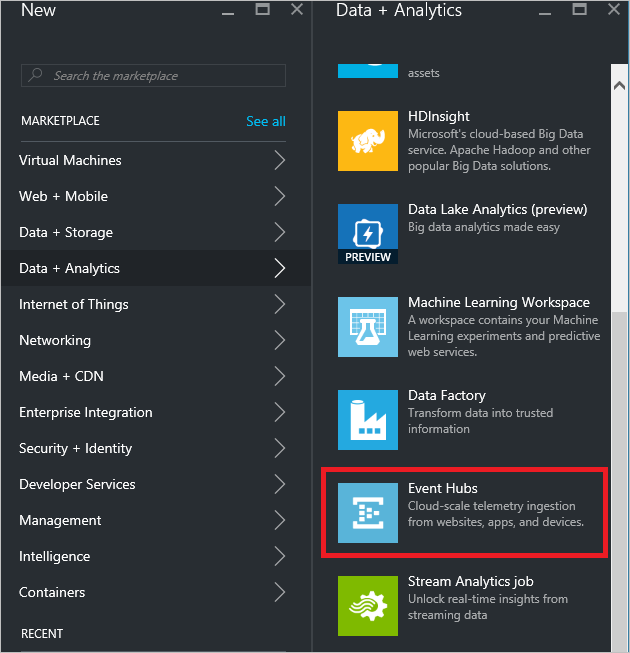
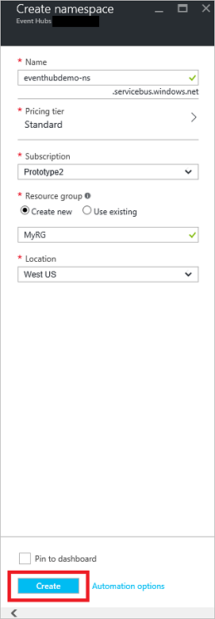
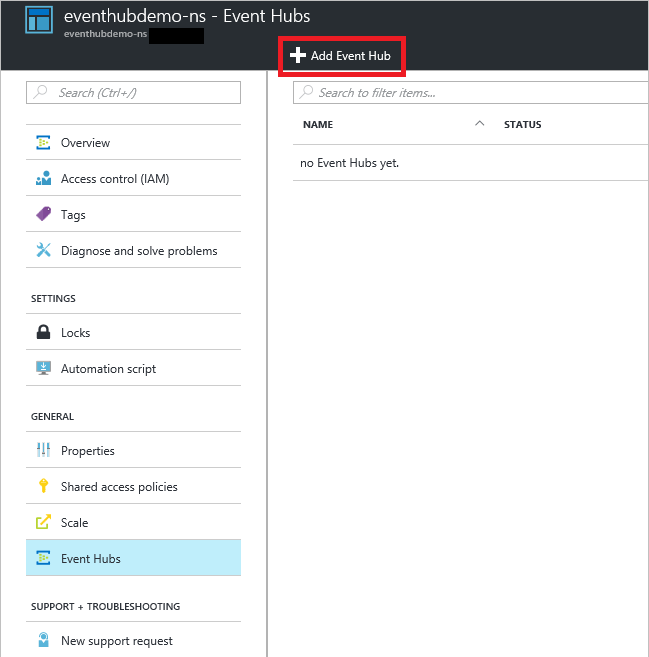

## 建立事件中心

1. 登入[Azure 入口網站][]中，然後按一下 [**新增**]，請在上方畫面左上角。

2. 按一下 [**資料 + 分析**]，然後按一下 [**事件集線器**。

    

3. 在**建立命名空間**刀中，輸入命名空間的名稱。 系統會立即檢查名稱是否有空。

    

4. 有確保命名空間名稱之後，請選擇 [（Basic 或標準） 的價格層。 此外，選擇 Azure 訂閱，資源] 群組中，並在其中建立資源的位置。 

2. 按一下 [**建立**]，建立命名空間]。

6. 在事件集線器命名空間清單中，按一下 [新建立的命名空間]。      

    

7. 在 [命名空間刀中，按一下 [**事件集線器**]。

    

8. 在刀頂端，按一下 [**新增事件中心**]。

    

3. 輸入您在 [事件] 中心內的名稱，然後按一下 [**建立**]。

    

4. 在清單中的事件集線器，請按一下 [新建立的事件中心名稱]。 

    

5. 傳回在命名空間刀 （不特定事件中心刀） 中，按一下 [**共用存取原則**]，然後按一下**RootManageSharedAccessKey**。

    

5. 按一下 [複製] 按鈕，複製到剪貼簿的**RootManageSharedAccessKey**連線字串。 儲存稍後在本教學課程中使用此連線字串。

    

現在建立事件中心，且您擁有您要傳送及接收事件的連線字串。

[Azure 入口網站]: https://portal.azure.com/