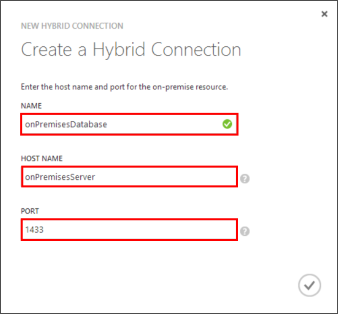

1. 在內部部署電腦上登入至[Azure 管理入口網站](http://manager.windowsazure.com)（這是舊的入口網站）。

2. 在功能窗格底部，選取 [ **+ 新增** > **應用程式服務** > **BizTalk 服務** > **建立自訂**。

3. 提供**BizTalk 服務名稱**，然後選取 [**版本**]。 

    本教學課程中使用**mobile1**。 您必須提供新 BizTalk 服務的唯一名稱。

4. BizTalk 服務建立之後，選取 [**混合式連線**] 索引標籤，然後按一下 [**新增**]。

    

    這樣會建立新的混合式連線。

5. 提供的**名稱**及**[主機名稱]**的混合式部署連線，並將**連接埠**設定為`1433`。 
  
    

    主機名稱是內部部署伺服器的名稱。 此設定的混合式連線存取連接埠 1433年上執行的 SQL Server。 如果您使用的具名的 SQL Server 執行個體，請改為使用您先前已定義的靜態連接埠。

6. 建立新連線時，狀態之後的新連線] 中顯示 [**內部部署設定不完整**。

7. 瀏覽至您的行動訊息服務按一下 [**設定**、 向下**混合式連線**捲動及**新增混合式部署連線**，然後選取您剛剛建立的混合式部署連線，然後按一下按一下**[確定]**。

    這可讓您使用新的混合式連線的行動訊息服務。

接下來，必須在內部部署電腦上安裝混合式連線管理員。