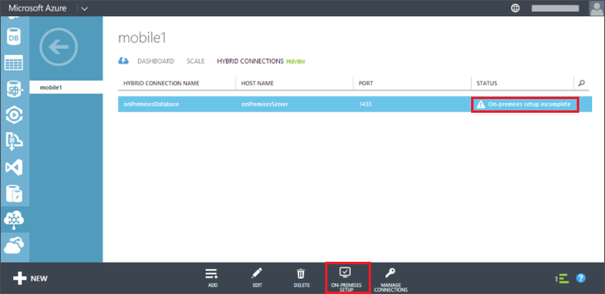

混合式連線管理員可讓您的內部部署電腦連線至 Azure 及轉送 TCP 流量。 您必須先安裝管理員可以連線到內部部署電腦您 SQL Server 執行個體。

1. 您剛剛建立的連線應有的**premesis 上設定不完整****狀態**。 按一下 [此連線]，然後按一下 [**內部部署安裝**。

    

2. 按一下 [**安裝並設定**]。

    這會安裝自訂的執行個體的連接管理員已預先設定，可使用您剛剛建立的混合式連線。

3. 完成其餘設定步驟的連接管理員。

    安裝完成之後，混合式連線狀態會變更**1 的執行個體已連線**。 您可能需要重新整理瀏覽器，請稍候幾分鐘。 

混合式連線設定現已完成。