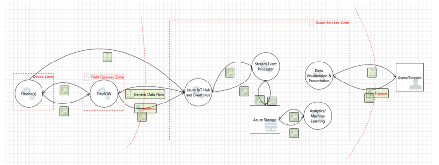

# 事項網際網路安全性架構

當設計系統時，務必了解該系統的潛在威脅及新增與適當的防禦措施據以，系統會設計及架構台。 務必特別是因為了解如何攻擊者可能會危害系統可以協助進行確認適當的安全防護已備妥從頭開始來設計安全性記住從開始產品。 

## 安全性開頭的威脅模型
 
Microsoft 時間已使用其產品的威脅模型與對公司的威脅模型公開可用的程序。 公司經驗示範 modelling 且未預期的優點以外的威脅有哪些最多立即知識與相關。 例如，它也會建立開啟討論 avenue 與其他人外開發小組，可能會導致新構思及產品中的改良功能。
  
威脅模型的目標是了解如何可能能夠危害系統並確定已備妥的適當減少攻擊。 部署設計小組考慮減少為系統的設計目的而不是系統之後的威脅模型 （英文） 強制。 此事實是嚴重重要，因為修整至各式各樣的欄位中的裝置安全性防禦是不可行，出錯與將會保留客戶的風險。

許多開發團隊執行擷取系統的優點客戶的功能需求實用工作。 不過，用來識別非明顯某人可能不當使用系統的方式是更具挑戰性。 威脅模型可協助開發小組了解攻擊者可執行的動作與原因。 威脅模型是結構化的程序會在系統中建立安全性的相關討論設計決策，以及設計的影響安全性隨時所做的變更。 只在文件威脅模型時，此文件也代表一個理想的方式來確定學到的知識、 課程保留持續，並說明新小組開始快速。 最後，威脅模型的結果是安全性的可讓您應考量，例如想要提供給您的客戶何種安全性承諾其他層面。 這些威脅模型搭配承諾會告知和磁碟機網際網路事項 (IoT) 解決方案的測試。
 

### 何時威脅模型

如果它併入設計階段[威脅模型](http://www.microsoft.com/security/sdl/adopt/threatmodeling.aspx)提供最大值。 時要設計，您可以變更以消除威脅最大的彈性。 根據設計帶來威脅是所要的結果。 是新增減少、 測試、 及確保其保留目前，此外，這類除去一些不一定是可能比更加簡便。 它變得很難產品變得更進步並接著最終需要更多的工作與比威脅早期在模型中的 sharepoint 開發的許多更困難利弊消除威脅。

### 新的威脅模型

您應該執行緒模型視為一個整體解決方案和也整個計畫重心在下列區域：

- 安全性和隱私權功能
- 其失敗所相關的安全性功能
- 觸控信任界限功能 

### 誰威脅模型

威脅模型是像其他任何在程序。  它會將類似的解決方案的任何其他元件的威脅模型文件和驗證其不錯的選項。 許多開發團隊執行擷取系統的優點客戶的功能需求實用工作。 不過，用來識別非明顯某人可能不當使用系統的方式是更具挑戰性。 威脅模型可協助開發小組瞭解攻擊者可執行的動作與原因。

### 如何威脅模型

包含四個步驟; 威脅模型程序步驟包括：

- 建立應用程式的模型
- 列舉的威脅
- 減輕威脅
- 驗證補救措施

#### 程序步驟

三個規則的縮圖時建立的威脅模型謹記下列事項：

1. 建立不在參考架構圖表。 
2. 啟動廣度優先。 概略了解，並視為一個整體，再深入深入了解系統。  這有助於確保該您深入-了解在右邊的位置。
3. 磁碟機之程序，不讓您磁碟機的程序。 如果您模型 （英文） 階段中找到的問題，而且想探索、 為其移至 ！  不要覺得您需要 slavishly 請遵循下列步驟。  

#### 威脅

具有以下四個核心元素的威脅模型：

- 程序 (web 服務、 Win32 服務 * nix 協助程式等。請注意不可能是當技術向下切入向下這些區域中的程序時可以區隔一些複雜的實體 （例如欄位閘道和感應器）。
- 資料會儲存 （任何位置儲存資料，例如設定檔或資料庫）
- 資料流 （其中資料移動其他應用程式中的項目之間）
- 外部的實體 （可以與系統互動的任何項目但不在控制項之下的應用程式、 範例包含使用者和附屬摘要）

架構圖中的所有項目會受到各種威脅;我們將會使用分散憶。 讀取[威脅模型重新分散](https://blogs.msdn.microsoft.com/larryosterman/2007/09/04/threat-modeling-again-stride/)了解更多關於分散元素。

不同的應用程式圖表的元素會受到某些分散威脅：

- 程序會受到分散
- 資料流會受到 TID
- 資料儲存區是 TID，以及有時 R，如果資料存放區記錄檔。
- 外部的實體會受到 SRD

## IoT 的安全性

已連線的特殊用途裝置有重大的潛在的互動呈現區域和互動模式，都必須考慮提供保護數位存取那些裝置的架構。 字詞"數位 access"使用以下知道透過直接裝置互動會執行任何作業透過實體的存取控制所提供存取安全性。 例如，諸裝置鎖定與聊天室上門。 時不能使用的軟體和硬體拒絕實體的存取，可採取量值系統干擾防止領導的實體的存取。 

當我們瀏覽互動模式、 我們將看看"裝置控制項 」 及 「 裝置資料 」 以相同的廣告。 「 裝置控制項 」 可分類為裝置由任何人所提供的目標變更或影響至接近其狀態或其環境的狀態其行為與任何資訊。 「 裝置資料 」 可分類為任何裝置發出到任何其他方其狀態及觀察到其環境狀態的相關的資訊。
   
若要最佳化安全性的最佳作法，建議的典型的 IoT 架構分成數個元件/區域的威脅模型練習一部分。 這些區域完整地說明整個這個區段中，並包括：

-   裝置
-   欄位閘道
-   雲端閘道，與
-   服務。

區域都是廣泛到分割解決方案;每個區域通常有其專屬資料和驗證和授權需求。 區域也可以使用隔離傷害及限制在較高的信任區域低信任區域的影響。

每個區域是以信任的界限，這點線的紅色列在下圖為上述分隔。 它代表從一個來源的資料/資訊的轉換到另一個。 這項轉換期間資料/資訊可能是受限於詐騙、 竄改、 否認性、 資訊洩漏、 拒絕服務及的最低權限提高權限 （分散）。

 

元件所述之每個界限內也係分散、 啟用完整 360 威脅模型之解決方案的檢視。 以下各節詳細說明在每個元件與特定安全性問題以及應該放入位置的解決方案。

遵循下列章節將討論標準通常找到這些區域] 中的元件。

### 裝置區域

裝置環境是繞裝置的即時實體空間其中實體存取及 （或)"區域網路 」 是合適的對等數位裝置的存取權。 "區域網路"假設其值為網路不同且絕緣從-但可能橋接至 – 公用網際網路，且包含允許的裝置的對等通訊任何短距離無線收音機技術。 其執行*不*包括建立這類的本機網路中的任何網路虛擬化技術和也不包含 public 運算子網路需要任何兩種裝置來如果交易輸入對等通訊關係跨越公用網路空間進行通訊。

### 欄位閘道區域

欄位閘道是裝置/appliance 或動作顯示做通訊程式以及，可能、 裝置控制系統和裝置資料處理 hub 一些一般用途的伺服器電腦軟體。 欄位閘道區域包含欄位閘道本身並附加至其中的所有裝置。 顧名思義，欄位閘道 act 外專用的資料處理設施、 通常是繫結的位置、 可能會受到實體入侵及會受限於操作的備援。 所有以指出欄位閘道通常是一個東西一個可以觸控和破壞時了解其函數的功能。 

欄位閘道等於平凡流量路由器，因為它已經有中管理存取的主動角色和資訊流程，這表示它一個應用程式定址的實體和網路連線或終端機工作階段。 NAT 裝置或防火牆，相較之下，不能限定欄位閘道由於不明確的連線或工作階段終端機但而路由 （或封鎖） 連線或透過他們的工作階段。 欄位閘道有兩種不同的呈現區域。 其中一個朝附加至該裝置及代表區域的內，而其他朝所有外部廠商提供及是區域的邊緣。   

### 雲端閘道區域

雲端閘道已啟用遠端通訊 from 和 to 裝置或從數個不同的站台] 欄位閘道之間通常向雲端式控制項和資料分析系統的這類系統的同盟的公用網路空間的系統。 在某些情況下，在雲端閘道可能會立即便利 access 特殊用途裝置從如平板電腦或電話的終端機。 在此處所討論的內容，「 雲端 」 是用來參照至未繫結至相同的網站之附加的裝置或欄位閘道專用的資料處理系統。 另外在雲端區域中，操作量值防止目標實體的存取並不一定是公開給"公用 cloud"基礎結構。  

雲端閘道可能可能會對應至以將雲端閘道以及其附加的裝置或從任何其他網路流量的欄位閘道的所有網路虛擬化重疊。 雲端閘道本身是未裝置控制系統也無法處理或裝置資料 ； 儲存設備與雲端閘道那些設施介面。 雲端閘道區域包括雲端閘道以及所有欄位閘道和直接或間接附加至其中的裝置。 區域的 edge 是其中所有外部廠商提供通訊透過不同介面區。

### 服務區域

「 服務 」 會定義為任何軟體元件或 critical 透過與裝置的欄位或雲端閘道的資料收集及分析，以及命令與控制項的模組此內容。  服務的中介。 他們擔任下至閘道和其他子系統接近其身分識別、 儲存及分析資料、 設立裝置問題命令取決於資料前瞻或排程公開資訊及控制功能授權的使用者。

### 資訊-裝置和特殊用途裝置的比較

Pc、 電話和平板電腦是主要互動式資訊裝置。 明確周圍最大化電池存留期最佳化電話和平板電腦。 他們最好關閉部分不會立即互動人員或時不提供播放等候音樂或其擁有人引導至特定位置的服務。 從系統觀點來看，這些資訊技術裝置主要當成向人員的 proxy。 他們是"人員傳動器"建議動作及 「 人員感應"收集的輸入。 

特殊用途裝置從到數千個元件內，使用複雜的原廠實際執行線路簡單溫度感應器的方式不同。 這些裝置會更加設定範圍的目的和即使他們提供一些使用者介面，其主要範圍設為源自於與或整合至實體世界中的資產。 他們測量和報告環境的情況下、 開啟閥、 控制 servos、 聲音警示、 切換指示燈，並執行其他許多工作。 它們協助資訊裝置是太一般、 太昂貴、 太大或太脆弱來執行工作。 具體目的立即以其技術設計指定為良好的可用貨幣預算針對實際執行與排程的存留期的作業。 下列兩個重要因素的組合會限制可操作能源預算、 實體之上與因此可用儲存 compute，與安全性功能。  

如果某個項目"移錯誤 」 與自動化或遠端可控制裝置，例如實體瑕疵或控制項的邏輯問題 willful 非法的入侵及操作。 可能會移除實際執行大量、 建築物可能 looted 或向下，燒錄和人員可能受傷或偶數死。 這是傷害的、 當然，整個不同類別比某人好幾十竊的信用卡的限制。 [安全性] 列讓進行移動的裝置和接收器導致事項移動的命令會最後產生的資料必須比中任何電子商務或銀行業案例。 

### 裝置控制項與裝置資料互動

已連線的特殊用途裝置具有潛在的互動呈現區域和互動模式，都必須考慮提供 framework 保護數位存取那些裝置的重要數。 字詞"數位 access"使用以下知道透過直接裝置互動會執行任何作業透過實體的存取控制所提供存取安全性。 例如，諸裝置鎖定與聊天室上門。 時不能使用的軟體和硬體拒絕實體的存取，可採取量值系統干擾防止領導的實體的存取。 
 
為我們瀏覽互動模式、 我們將查看 「 裝置控制項 」 及 「 裝置資料 」 與廣告威脅模型時的相同層級。 「 裝置控制項 」 可分類為裝置由任何人所提供的目標變更或影響至接近其狀態或其環境的狀態其行為與任何資訊。 「 裝置資料 」 可分類為任何裝置發出到任何其他方其狀態及觀察到其環境狀態的相關的資訊。 

## 威脅模型 Azure IoT 參考架構

Microsoft 會使用上述不要威脅的 Azure IoT modelling 架構。 在下一節中我們因此使用 Azure IoT 參考架構具體範例示範如何考慮 modelling IoT 的威脅以及如何處理所識別的威脅。 在我們的案例我們所識別焦點的四個主要的區域：

-   裝置與資料來源
-   資料傳輸
-   裝置和事件處理和
-   簡報

 

下圖提供 Microsoft 的 IoT 架構的簡化的檢視使用由 Microsoft 威脅模型工具資料流程圖模型：

請務必注意架構所分隔的裝置和閘道的功能。 這可讓使用者利用更安全的閘道裝置： 它們雖能夠與雲端閘道使用安全通訊協定，通常需要更大處理負擔，原生裝置-例如 thermostat-無法提供合用進行通訊。 Azure 服務在區域中，我們假設雲端閘道以 Azure IoT Hub 服務來表示。

### 裝置與資料來源/資料傳輸

本節探討威脅模型 （英文） 的情況下透過以上所述的架構並概述如何我們所定址固有問題的部分。 我們將焦點放在的威脅模型核心元素：

- （我們控制與外部項目底下與其） 的程序
- （也稱為資料流） 的通訊
- 儲存區 （也稱為資料存放區）

#### 程序

在每個 Azure IoT 架構中所述的類別，我們嘗試將整個資料/資訊存在於中的不同階段減輕許多不同的威脅： 程序、 通訊、 與儲存區。 下面我們賦與最常見的後面的方式這些可能最適合降低概觀 」 程序 」 類別的概觀： 

**詐騙 (S)**: 攻擊者可能會從裝置]，其中一個層級軟體或硬體，擷取密碼編譯的主要材料和存取不同的實體或虛擬裝置身分識別系統的裝置的主要材料後續採取從。 良好的圖是遠端控制項，可以開啟任何 TV 且該常用惡作劇工具。

**服務拒絕 (D)**： 卻無法運作，或藉由干擾無線電頻率或剪下線路進行通訊的轉譯裝置。 例如，攝影機鎖刻意 knocked 其 power 或網路連線將所有報告資料。

**竄改 (T)**: 攻擊者可能會局部或全部取代裝置上執行的軟體可能會允許取代的軟體如果主要材料或密碼編譯設施保留索引鍵的資料提供給非法程式運用正版裝置的 identity。 例如，攻擊者可能會利用解壓縮的主要材料來攔截並隱藏的通訊路徑上之裝置資料並取代為 false 竊的主要材料已驗證的資料。

**(I) 的資訊洩漏**： 如果裝置執行操控的軟體，這類操控的軟體可能無法外洩未經授權的廠商提供的資料。 例如，攻擊者可能會利用解壓縮的主要材料本身插入裝置與控制站或欄位的閘道或雲端閘道 siphon 關閉資訊之間的通訊路徑。

**最低權限提高權限 (E)**： 沒有特定函數的裝置可以強制執行其他動作。 若要開啟 [一直例如騙了開啟半方式編寫閥。

| **元件** | **威脅** | **減輕方式**                                                                                                                                                | **風險**                                                                                                                                                                                                    | **實作**                                                                                                                                                                                                                                                                                                                                     |
|---------------|------------|---------------------------------------------------------------------------------------------------------------------------------------------------------------|-------------------------------------------------------------------------------------------------------------------------------------------------------------------------------------------------------------|--------------------------------------------------------------------------------------------------------------------------------------------------------------------------------------------------------------------------------------------------------------------------------------------------------------------------------------------------------|
| 裝置        | S          | 指派給裝置的身分識別與驗證裝置                                                                                                | 取代一些其他裝置的裝置的一部分。 我們怎麼知道我們談的正確的裝置？                                                                                           | 驗證使用傳輸層安全性 (TLS) 或 IPSec 的裝置。 基礎結構應該支援使用預先共用的金鑰 (PSK) 無法處理完整非對稱的密碼編譯這些裝置上。 利用 Azure AD、 [OAuth](http://www.rfc-editor.org/in-notes/internet-drafts/draft-ietf-ace-oauth-authz-01.txt)                             |
|               | TRID       | 適用於因為誤用而出錯機制裝置例如方法是讓它很難無法從裝置擷取機碼及其他密碼編譯的資料。 | 風險是如果某人竄改裝置 （實體干擾）。 使用方式，我們確定，該裝置是否不竄改。                                                                                 | 最有效地減輕是允許儲存在特殊的晶片上電路機碼的讀取，但只能用於使用機碼，但永遠不洩漏金鑰的密碼編譯作業中的機碼的受信任的平台模組 (TPM) 功能。 記憶體加密的裝置。 裝置的金鑰管理。 簽署的程式碼。 |
|               | E          | 具有之裝置的存取控制。 授權配置。                                                                                                    | 如果裝置允許個別的動作得以執行根據從外部來源或甚至是洩漏的感應命令，它會允許存取否則無法執行作業攻擊。 | 具有裝置的授權配置                                                                                                                                                                                                                                                                                                             |
| 欄位閘道 | S          | 驗證欄位閘道到雲端閘道 (cert 架構、 PSK、 宣告架構、 主題)                                                                           | 如果有人可詐騙欄位閘道，然後它可以呈現本身為任何裝置。                                                                                                                               | TLS RSA/IPSe、 PSK [RFC 4279](https://tools.ietf.org/html/rfc4279)。 所有相同一般 – 在裝置的主要儲存區與審查顧慮最佳的情況下會使用 TPM。 若要支援無線接收器網路 (WSN) 的 IPSec 的 6LowPAN 副檔名。                                                                                                              |
|               | TRID       | 保護欄位閘道對竄改 (TPM？)                                                                                                            | 詐騙欺騙它通訊欄位閘道雲端閘道思考攻擊可能會導致資訊洩露及資料竄改                                                             | 記憶體加密 TPM 的、 驗證。                                                                                                                                                                                                                                                                                                              |
|               | E          | 欄位閘道的存取控制機制                                                                                                                    |                                                                                                                                                                                                             |                                                                                                                                                                                                                                                                                                                                                        |

以下是此類別中的潛在威脅的一些範例：

詐騙： 攻擊者可能會從裝置]，在軟體或硬體層級及後續存取不同的實體或虛擬裝置身分識別系統的裝置的主要材料取自中擷取密碼編譯的主要材料。

**拒絕服務**︰ 卻無法運作，或藉由干擾無線電頻率或剪下線路進行通訊的轉譯裝置。 例如攝影機鎖刻意 knocked 其 power 或網路連線將所有報告資料。

**竄改**︰ 攻擊者可能部分或全部取代裝置上執行的軟體可能會允許取代的軟體如果主要材料或密碼編譯設施保留索引鍵的資料提供給非法程式運用正版裝置的 identity。

**竄改**︰ 顯示的空白走廊可見兩端圖片攝影機無法瞄準這類走廊的相片。 或區塊消防接收器無法報表某人保留在其下的較亮。 在不論執行哪項裝置可能會嚴格來說完全電腦向系統，但它將會報告操控的資訊。

**竄改**︰ 攻擊者可能並用來攔截和隱藏的通訊路徑上之裝置資料並取代為 false 資料的驗證與竊的主要材料解壓縮的主要材料。

**竄改**︰ 攻擊者可能部分或完全取代裝置上執行的軟體可能會允許取代的軟體如果主要材料或密碼編譯設施保留索引鍵的資料提供給非法程式利用正版裝置的 identity。
   
**資訊洩漏**： 如果裝置執行操控的軟體，這類操控的軟體可能無法外洩未經授權的廠商提供的資料。

**資訊洩漏**： 攻擊者可能會利用解壓縮的主要材料本身插入裝置的控制站或欄位閘道或關閉資訊 siphon 雲端閘道之間的通訊路徑。

**拒絕服務**︰ 裝置可以關閉或轉換成模式通訊不可能 （這是刻意許多業界機器中）。

**竄改**： 裝置可以重新設定操作未知控制系統 （外部已知的校正參數） 的狀態與因此提供可能會解譯的資料

**權限提高**： 沒有特定函數的裝置可以強制執行其他動作。 若要開啟 [一直例如騙了開啟半方式編寫閥。

**拒絕服務**： 裝置可以轉換成通訊不可能的狀態。

**竄改**︰ 裝置可以重新設定操作 （外部已知的校正參數） 的控制項系統未知的狀態與因此提供可能會解譯的資料。
 
**否認性詐騙/竄改**： 如果不安全 （這很少是消費者遠端控制項的大小寫） 的攻擊者可以匿名操作狀態的裝置。 良好的圖是遠端控制項，可以開啟任何 TV 以及常用惡作劇工具。

#### 通訊

裝置、 裝置和欄位閘道和裝置和雲端閘道之間的通訊路徑周圍的潛在威脅。 下表包含一些指南周圍裝置/VPN 上開啟通訊端：

| **元件**               | **威脅** | **減輕方式**                                      | **風險**                                                                                                      | **實作**                                                                                                                                                                                                                                                                                                                                                               |
|-----------------------------|------------|-----------------------------------------------------|---------------------------------------------------------------------------------------------------------------|----------------------------------------------------------------------------------------------------------------------------------------------------------------------------------------------------------------------------------------------------------------------------------------------------------------------------------------------------------------------------------|
| 裝置 IoT Hub              | TID        | (D)TLS (PSK/RSA) 加密流量             | 竊聽或干擾裝置和閘道之間的通訊                             | 通訊協定層級安全性。 使用自訂的通訊協定，我們需要了解如何保護這些。 在大多數情況下，將通訊方式從裝置到 IoT 中樞 （裝置啟始連線）。                                                                                                                                                                 |
| 裝置的裝置               | TID        | (D)TLS (PSK/RSA) 加密的流量。            | 讀取裝置之間傳送過程中的資料。 竄改的資料。 超載新連線的裝置 | 安全性通訊協定層級 (MQTT/AMQP/HTTP/CoAP。 使用自訂的通訊協定，我們需要了解如何保護這些。 DoS 威脅減輕方式是對等裝置透過雲端或欄位的閘道，並且將唯一 act 為網路向用戶端。 對等可能會導致之後擁有已代理的閘道對等之間的直接連線 |
| 外部的實體裝置      | TID        | 強式配對裝置的外部實體 | 竊聽裝置的連線。 干擾裝置的通訊                     | 安全地配對裝置 NFC/Bluetooth LE 外部的實體。 控制 [作業] 面板中的之裝置 （實體）                                                                                                                                                                                                                                                  |
| 欄位閘道雲端閘道 | TID        | TLS (PSK/RSA) 加密的流量。               | 竊聽或干擾裝置和閘道之間的通訊                             | 安全性通訊協定層級 (MQTT/AMQP/HTTP/CoAP)。 使用自訂的通訊協定，我們需要了解如何保護這些。                                                                                                                                                                                                                                                       |
| 裝置雲端閘道        | TID        | TLS (PSK/RSA) 加密的流量。               | 竊聽或干擾裝置和閘道之間的通訊                             | 通訊協定層級 (MQTT/AMQP/HTTP/CoAP) 的安全性。 使用自訂的通訊協定，我們需要了解如何保護這些。                                                                                                                                                                                                                                                       |

以下是這個類別的威脅的一些範例：

**拒絕服務**： 限制的裝置通常下 DoS 威脅當他們正在聆聽的輸入的連線或在網路上的來路不明的資料包因為攻擊者可以開啟許多同時連線且未服務它們或很慢，這些服務或裝置可以大量湧入來路不明的流量。 在這兩種情況下，裝置可以有效地呈現在網路上無法運作。

**詐騙、 資訊洩漏**： 限制的裝置和特殊用途的裝置通常有一個的所有安全性設施密碼或 PIN 保護或他們所依賴完全信任網路，這表示他們會授與存取資訊當裝置位於相同網路上，並且該網路通常只受到共用的索引鍵。 這表示當根據裝置或網路共用的密碼，有可能來控制裝置或觀察發出之裝置的資料。  

**詐騙**： 攻擊者可能會攔截或部分覆寫廣播和詐騙建立者 （攔截式）

**竄改**： 攻擊者可能會攔截或部分廣播會覆寫及傳送 false 資訊 

**資訊洩漏：**攻擊者可能會在廣播竊聽並取得未經授權的資訊**拒絕服務︰**攻擊者可能會干擾廣播的訊號和拒絕資訊通訊群組

#### 儲存區

每個裝置和欄位閘道都有某些儲存體 （佇列資料、 os 圖像儲存區的暫存） 的表單。

| **元件**                            | **威脅** | **減輕方式**                       | **風險**                                                                                                                                                                                                                                                                                                                | **實作**                                                                                                                                                     |
|------------------------------------------|------------|--------------------------------------|-------------------------------------------------------------------------------------------------------------------------------------------------------------------------------------------------------------------------------------------------------------------------------------------------------------------------|------------------------------------------------------------------------------------------------------------------------------------------------------------------------|
| 裝置儲存區                           | TRID       | 儲存加密、 簽署記錄檔 | 讀取竄改遙測資料的資料從儲存體 （PII 資料）。 竄改排入佇列或快取命令控制項資料。 竄改設定] 或 [韌體更新套件快取或在本機上排入佇列時可能會導致危害 OS 和/或系統元件                                         | 加密、 訊息驗證碼 (MAC) 或數位簽章。 其中可能的強式存取控制透過資源的存取控制清單 (Acl) 或權限。 |
| 裝置作業系統映像                          | TRID       |                                      | 竄改 OS/取代 OS 元件                                                                                                                                                                                                                                                                         | 唯讀 OS 分割簽署 OS 映像，加密                                                                                                                    |
| 欄位閘道儲存區 （佇列資料） | TRID       | 儲存加密、 簽署記錄檔 | 讀取竄改遙測資料的資料儲存區 （PII 資料） 從竄改排入佇列或快取命令控制項資料。 竄改設定] 或 [韌體更新套件 （目的地裝置或欄位閘道） 快取或在本機上排入佇列時可能會導致危害 OS 和/或系統元件 | BitLocker                                                                                                                                                              |
| 欄位閘道 OS 映像                   | TRID       |                                      | 竄改 OS/取代 OS 元件                                                                                                                                                                                                                                                                          | 唯讀 OS 分割簽署 OS 映像，加密                                                                                                                    |

### 裝置和事件處理/雲端閘道區域

雲端閘道已啟用遠端通訊 from 和 to 裝置或從數個不同的站台] 欄位閘道之間通常向雲端式控制項和資料分析系統的這類系統的同盟的公用網路空間的系統。 在某些情況下，在雲端閘道可能會立即便利 access 特殊用途裝置從如平板電腦或電話的終端機。 在此處所討論的內容，「 雲端 」 用來參照至未繫結至相同的網站附加的裝置或欄位閘道專用的資料處理系統，其中操作量值目標實體的存取，但是不一定是"公用 cloud"基礎結構。  雲端閘道可能可能會對應至以將雲端閘道以及其附加的裝置或從任何其他網路流量的欄位閘道的所有網路虛擬化重疊。 雲端閘道本身是未裝置控制系統也無法處理或裝置資料 ； 儲存設備與雲端閘道那些設施介面。 雲端閘道區域包括雲端閘道以及所有欄位閘道和直接或間接附加至其中的裝置。

雲端閘道多半是軟體的自訂內建的段以服務方式執行使用的欄位閘道和裝置連線的公開端點。 因此必須設計的安全性考量事項。 請按照[SDL](http://www.microsoft.com/sdl)設計與建置這項服務的程序。 

#### 服務區域

控制系統 （或控制站） 是一套軟體解決方案的介面 （英文） 與裝置或欄位閘道或 cloud 閘道基於控制一或多種裝置和/或收集及/或存放及/或分析簡報、 或便於後續控制的裝置資料。 控制系統是可能會立即便利人員互動本篇討論範圍內唯一的實體。 中級實體控制項循 like 交換器允許一個人來關閉裝置或變更其他屬性，且為其中有無功能等同項目以數位方式可存取的裝置位於例外狀況。 

中級實體控制項表面是指其中任何排序的管理邏輯包含之實體的控制項介面函數如此相等的函數可以從遠端起始或遠端輸入的衝突可以避免使用 – 這類 intermediated 的控制項循的概念上附加至如何運用相同的基礎功能裝置可能會附加至平行的任何其他遠端控制系統的本機控制系統。 雲端運算可讀取在[雲端安全性結盟 (CSA)](https://cloudsecurityalliance.org/research/top-threats/)頁面上方的威脅。

## 其他資源

請參閱如需其他資訊的下列文章：

- [SDL 威脅模型 （英文） 工具](https://www.microsoft.com/sdl/adopt/threatmodeling.aspx)
- [Microsoft Azure IoT 參考架構](https://azure.microsoft.com/updates/microsoft-azure-iot-reference-architecture-available/)
 
