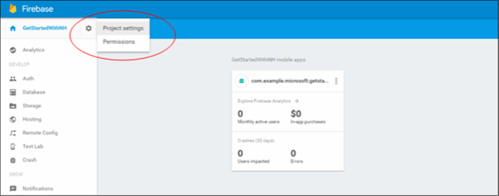

1. 登入[Firebase 主控台](https://firebase.google.com/console/)。 如果您還沒有其中一個，請建立新的 Firebase 專案。
2. 建立專案之後按一下 [**新增至您的 Android 應用程式的 Firebase** ，然後依照所提供的指示進行。

    

3. 在 Firebase 主控台中，按一下齒輪專案，然後按一下**專案設定**。

    

4. 按一下您的專案設定**雲端訊息**] 索引標籤，然後複製**伺服器索引鍵**和**寄件者識別碼**的值。  這些值將用於稍後設定通知中心存取原則以及您通知的處理常式的應用程式。
  