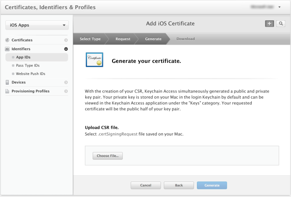
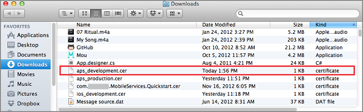
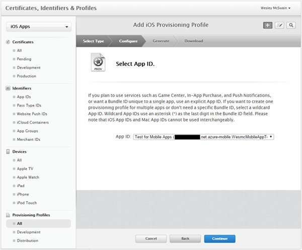

若要註冊推播通知透過 Apple 推入通知服務 (APNS) 應用程式，您必須在 Apple 的開發人員入口網站上建立新的推播憑證應用程式識別碼與佈建的設定檔的專案。 應用程式識別碼會包含設定的設定，可讓您的應用程式傳送及接收推入通知。 這些設定會包含驗證與 Apple 推入通知服務 (APN) 時傳送和接收推入通知所需的推入通知憑證。 如需詳細資訊，這些概念，請參閱正式[Apple 推入通知服務](http://go.microsoft.com/fwlink/p/?LinkId=272584)文件。

####產生的推播憑證的憑證簽署要求檔案

這些步驟會引導您完成建立的憑證簽署要求。 這將會用於產生推入用於的 APN 憑證。

1. 在 Mac 上執行 [鑰匙圈存取] 工具。 可以開啟 [**公用**資料夾或啟動鍵台上的 [**其他**資料夾。

2. 按一下 [**鑰匙圈存取**]，展開**憑證小幫手**]，然後按一下 [**要求憑證從憑證授權單位...**]。

    

3. 選取您的**使用者電子郵件地址**和**常見的名稱**，請確定已**儲存到磁碟**到的，再按一下 [**繼續]**。 當您不需要，讓**CA 電子郵件地址**欄位為空白的。

    

4. 在 [**另存新檔**輸入憑證簽署要求 (CSR) 檔案的名稱、**位置**，在選取的位置，然後按一下 [**儲存**。

    

    這會 CSR 檔案儲存在所選的位置。預設位置是在桌面中。 請記住選擇此檔案的位置。

####註冊您的應用程式推播通知

Apple 以建立新應用程式的明確應用程式識別碼，並也將它設定推播通知。  

1. 瀏覽至 [Apple 開發人員中心[iOS 提供入口網站](http://go.microsoft.com/fwlink/p/?LinkId=272456)以您的 Apple ID 登入、**識別碼**，然後按一下 [**應用程式識別碼**]，然後按一下最後按一下 [在**+**註冊新的應用程式登入。

    

2. 更新新的應用程式的下列三個欄位，然後按一下 [**繼續]**:

    * **名稱**︰ 在 [**應用程式識別碼描述**] 區段中的 [**名稱**] 欄位中輸入您的應用程式的描述性名稱。

    * **套件識別碼**︰**明確的應用程式識別碼**] 區段中，在表單中輸入一個**套件識別碼** `<Organization Identifier>.<Product Name>` [應用程式散發指南](https://developer.apple.com/library/mac/documentation/IDEs/Conceptual/AppDistributionGuide/ConfiguringYourApp/ConfiguringYourApp.html#//apple_ref/doc/uid/TP40012582-CH28-SW8)所述。 這必須符合也用途 XCode、 Xamarin 或 Cordova 專案中的應用程式。

    * **推播通知]**: 核取**應用程式服務**] 區段中的 [**推入通知**] 選項。

    

3.  在 [確認您的應用程式識別碼畫面中，檢閱的設定，然後進行您已驗證後按一下 [**送出**

4.  一旦您已經提交新的應用程式識別碼，您會看到**完成註冊**畫面。 按一下 [**完成**]。

5. 在開發人員中心]，在 [應用程式識別碼] 底下，找出剛剛建立的並按一下 [上一列的應用程式識別碼。 按一下 [應用程式識別碼] 資料列上，將會顯示應用程式詳細資料。 按一下底部的 [**編輯**] 按鈕。

6. 向下捲動至 [] 畫面底部，按一下 [**建立憑證...** ] 按鈕**開發推播 SSL 憑證**] 區段下。

    

    這會顯示 [新增 iOS 憑證] 小幫手]。

    > [AZURE.NOTE] 本教學課程中使用開發憑證。 登錄生產憑證時，會使用相同的程序。 請確定您使用相同的憑證類型時傳送通知。

7. 按一下 [**選擇檔案**，瀏覽至您的推播憑證儲存 CSR 的位置。 然後按一下 [**產生]**。

    

8. 建立憑證入口網站後，按一下 [**下載**] 按鈕。

    

    此下載憑證，並將它儲存到您的電腦，您的 [下載] 資料夾中。

    

    > [AZURE.NOTE] 根據預設，下載的檔案開發憑證名稱為**aps_development.cer**。

9. 按兩下下載推播憑證**aps_development.cer**。 這會安裝新的憑證的鑰匙圈，如下所示︰

    

    > [AZURE.NOTE] 在您的憑證名稱可能不同，但將會加**Apple 開發 iOS 推入服務︰**。

10. 在鑰匙圈存取，請以滑鼠右鍵按一下您剛建立 [**憑證**] 類別中的新推播憑證。 按一下 [**匯出**的檔案名稱]、 選取**.p12**的格式，，再按一下 [**儲存**。

    請記住的檔案名稱及匯出的.p12 推播憑證的位置。 將會用於傳 Azure 傳統入口網站上啟用 APNS 驗證。

####建立佈建應用程式的設定檔

1. 在<a href="http://go.microsoft.com/fwlink/p/?LinkId=272456" target="_blank">iOS 提供入口網站</a>中，選取 [**佈建的設定檔**，選取 [**所有**]，然後按一下**+**按鈕建立新的設定檔。 這會啟動**新增 iOS Provisiong 設定檔**精靈

    

2. 選取**iOS 應用程式開發****開發**作為 provisiong 設定檔類型，然後按一下 [**繼續**]。

3. 接下來，請選取您剛才從**應用程式識別碼**] 下拉式清單中，建立的應用程式識別碼，然後按一下 [**繼續**]

    

4. 在 [**選取憑證**] 畫面中，選取您使用的程式碼簽署的開發憑證，然後按一下 [**繼續**]。 這是一個簽署憑證不您剛剛建立的推播憑證。

    

5. 接下來，選取要用於測試的**裝置**，然後按一下 [**繼續**]

    

6. 最後，選擇**設定檔名稱**中的設定檔的名稱，按一下 [**產生]**。

    
