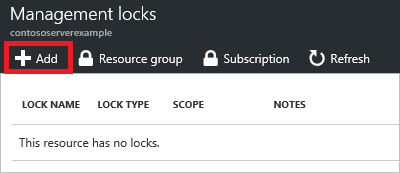

1. 在 [設定防禦資源、 資源] 群組中，或您想要鎖定的訂閱，以選取 [**鎖定**]。

      

2. 若要新增鎖定，選取 [**新增**。 如果您想要建立父層級的鎖定，請選取上層。 目前選取的資源從上層繼承權鎖定。 例如，您無法鎖定鎖定對所有資源的 [資源] 群組。

       

3. 授與鎖定的名稱，然後鎖定層級。 或者，您可以新增描述鎖定的備忘稿。

       

4. 若要刪除鎖定，請選取省略符號及**刪除**從可用的選項。

       