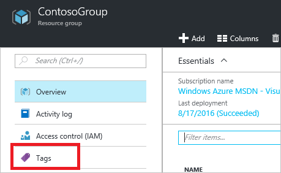
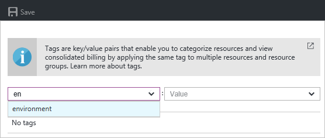
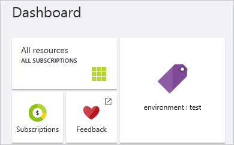

1. 若要新增標籤至現有的資源與資源群組，請選取 [標籤] 圖示。 

     

1. 您會看到您的組織已經套用到資源標記的清單。 如果您尚未套用標籤，清單會是空的。 若要新增標籤，只是指定的名稱及值，然後按 Enter。 您已新增幾個標籤之後，您會看到 [自動完成] 選項，根據現有的標籤名稱和值。 自動完成選項確保您的資源一致的分類，並避免常見的錯誤，例如拼字錯誤。

     

1. 若要檢視的標籤分類入口網站中，選取 [**其他服務**和**標記**。

     

1. 您會看到標籤摘要中您的訂閱。

     

1. 選取以顯示資源與資源群組該標籤的標籤。

     

1. [固定至您的儀表板，以快速存取最重要的標籤。

     
