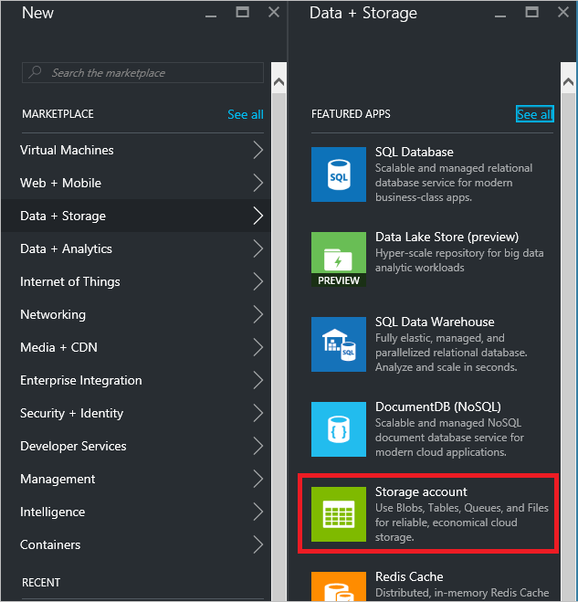

## <a name="receive-messages-with-eventprocessorhost"></a>接收郵件] 使用 EventProcessorHost

[EventProcessorHost][]簡化接收事件來管理持續檢查點事件集線器.NET 類別，而平行會接收來自這些事件集線器。 使用[EventProcessorHost][]，您可以分割事件跨多個接收器，即使裝載於不同的節點。 此範例顯示如何使用單一收[EventProcessorHost][] 。 [調整出事件處理][]範例示範如何使用多個接收器[EventProcessorHost][] 。

若要使用[EventProcessorHost][]，您必須擁有[Azure 儲存體帳戶][]︰

1. 登入[Azure 入口網站][]中，然後按一下 [**新增**]，請在上方畫面左上角。

2. 按一下 [**資料 + 的儲存空間**]，然後按一下 [**儲存帳戶**。

    

3. 在**建立儲存帳戶**刀中，輸入儲存帳戶的名稱。 選擇 Azure 訂閱、 資源] 群組中，並在其中建立資源的位置。 然後按一下 [**建立**。

    

4. 在儲存帳戶的清單中，按一下 [新建立的儲存空間帳戶。

5. 在儲存帳戶刀中，按一下 [**便捷鍵**。 複製**key1**稍後在本教學課程中使用的值。

    

4. 在 Visual Studio 中，建立新的 Visual C# 桌面應用程式專案使用**主控台應用程式**的專案範本。 專案**收件者**的名稱。

    

5. 在方案總管解決方案，請以滑鼠右鍵按一下，然後按一下**管理 NuGet 套件的解決方案**。

6. 按一下 [**瀏覽**] 索引標籤，然後搜尋`Microsoft Azure Service Bus Event Hub - EventProcessorHost`。 請確定在 [**版本**] 方塊中已指定的專案名稱 （**收件者**）。 按一下 [**安裝**]，並接受使用規定。

    

    Visual Studio 下載、 安裝，並新增[Azure 服務匯流排事件中心 EventProcessorHost NuGet 套件](https://www.nuget.org/packages/Microsoft.Azure.ServiceBus.EventProcessorHost)，所有相依性的參考。

7. 以滑鼠右鍵按一下 [**收件者**專案，按一下 [**新增**]，再按一下**類別**。 命名新課程**SimpleEventProcessor**，，然後按一下 [**新增**]，以建立類別。

    

8. 在 SimpleEventProcessor.cs 檔案頂端新增下列陳述式︰

    ```
    using Microsoft.ServiceBus.Messaging;
    using System.Diagnostics;
    ```

    然後，以取代下列程式碼的類別︰

    ```
    class SimpleEventProcessor : IEventProcessor
    {
        Stopwatch checkpointStopWatch;

        async Task IEventProcessor.CloseAsync(PartitionContext context, CloseReason reason)
        {
            Console.WriteLine("Processor Shutting Down. Partition '{0}', Reason: '{1}'.", context.Lease.PartitionId, reason);
            if (reason == CloseReason.Shutdown)
            {
                await context.CheckpointAsync();
            }
        }

        Task IEventProcessor.OpenAsync(PartitionContext context)
        {
            Console.WriteLine("SimpleEventProcessor initialized.  Partition: '{0}', Offset: '{1}'", context.Lease.PartitionId, context.Lease.Offset);
            this.checkpointStopWatch = new Stopwatch();
            this.checkpointStopWatch.Start();
            return Task.FromResult<object>(null);
        }

        async Task IEventProcessor.ProcessEventsAsync(PartitionContext context, IEnumerable<EventData> messages)
        {
            foreach (EventData eventData in messages)
            {
                string data = Encoding.UTF8.GetString(eventData.GetBytes());

                Console.WriteLine(string.Format("Message received.  Partition: '{0}', Data: '{1}'",
                    context.Lease.PartitionId, data));
            }

            //Call checkpoint every 5 minutes, so that worker can resume processing from 5 minutes back if it restarts.
            if (this.checkpointStopWatch.Elapsed > TimeSpan.FromMinutes(5))
            {
                await context.CheckpointAsync();
                this.checkpointStopWatch.Restart();
            }
        }
    }
    ```

    從 [事件] 中心收到的程序事件**EventProcessorHost**會呼叫此課程。 請注意，`SimpleEventProcessor`類別使用 stopwatch 定期呼叫檢查點上的方法**EventProcessorHost**內容。 如此一來，可確保，如果重新啟動收件者時，它將會遺失不超過五分鐘處理工作。

9. 在**程式**類別中，新增下列`using`在檔案頂端的陳述式︰

    ```
    using Microsoft.ServiceBus.Messaging;
    ```

    然後，取代`Main`中的方法`Program`課程下列程式碼，取代事件中心名稱和命名空間層級連接字串您先前儲存的儲存空間帳戶和您在前一節中複製的金鑰。 

    ```
    static void Main(string[] args)
    {
      string eventHubConnectionString = "{Event Hub connection string}";
      string eventHubName = "{Event Hub name}";
      string storageAccountName = "{storage account name}";
      string storageAccountKey = "{storage account key}";
      string storageConnectionString = string.Format("DefaultEndpointsProtocol=https;AccountName={0};AccountKey={1}", storageAccountName, storageAccountKey);

      string eventProcessorHostName = Guid.NewGuid().ToString();
      EventProcessorHost eventProcessorHost = new EventProcessorHost(eventProcessorHostName, eventHubName, EventHubConsumerGroup.DefaultGroupName, eventHubConnectionString, storageConnectionString);
      Console.WriteLine("Registering EventProcessor...");
      var options = new EventProcessorOptions();
      options.ExceptionReceived += (sender, e) => { Console.WriteLine(e.Exception); };
      eventProcessorHost.RegisterEventProcessorAsync<SimpleEventProcessor>(options).Wait();

      Console.WriteLine("Receiving. Press enter key to stop worker.");
      Console.ReadLine();
      eventProcessorHost.UnregisterEventProcessorAsync().Wait();
    }
    ```

> [AZURE.NOTE] 本教學課程中使用[EventProcessorHost][]一個執行個體。 若要增加處理量，建議您執行多個執行個體的[EventProcessorHost][]，[調整出事件處理][]範例所示。 在這些情況下，不同的執行個體會自動與協調彼此負載平衡收到的事件。 如果您想要每一個處理程序*所有*的多個接收器事件，您必須使用**ConsumerGroup**概念。 接收時事件從不同的電腦，可能有幫助的根據機器 （或角色） [EventProcessorHost][]執行個體名稱中已部署。 如需有關這些主題的詳細資訊，請參閱[事件集線器概觀][]與[事件集線器程式設計指南][]主題。

<!-- Links -->
[事件集線器概觀]: ../articles/event-hubs/event-hubs-overview.md
[事件集線器程式設計指南]: ../articles/event-hubs/event-hubs-programming-guide.md
[橫向事件處理]: https://code.msdn.microsoft.com/Service-Bus-Event-Hub-45f43fc3
[Azure 儲存體帳戶]: ../articles/storage/storage-create-storage-account.md
[EventProcessorHost]: http://msdn.microsoft.com/library/azure/microsoft.servicebus.messaging.eventprocessorhost(v=azure.95).aspx
[Azure 入口網站]: https://portal.azure.com