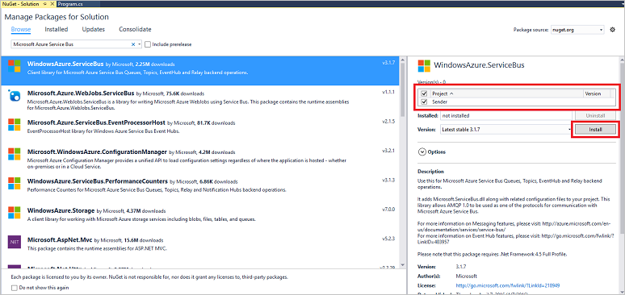

## <a name="send-messages-to-event-hubs"></a>傳送郵件給事件集線器

在此區段中，您會撰寫會事件傳送給您的事件中心 Windows 主控台應用程式。

1. 在 Visual Studio 中，建立新的 Visual C# 桌面應用程式專案使用**主控台應用程式**的專案範本。 專案的 [**寄件者**的名稱。

    

2. 在方案總管解決方案，請以滑鼠右鍵按一下，然後按一下**管理 NuGet 套件的解決方案**。 

3. 按一下 [**瀏覽**] 索引標籤，然後搜尋`Microsoft Azure Service Bus`。 請確定在 [**版本**] 方塊中已指定的專案名稱 （**寄件者**）。 按一下 [**安裝**]，並接受使用規定。 

    

    Visual Studio 下載、 安裝，並新增[Azure 服務匯流排文件庫 NuGet 套件](https://www.nuget.org/packages/WindowsAzure.ServiceBus)的參考。

4. 新增下列`using` **Program.cs**檔案頂端的陳述式︰

    ```
    using System.Threading;
    using Microsoft.ServiceBus.Messaging;
    ```

5. 將下列欄位新增至該**程式**類別，您在前一節和您先前儲存的命名空間層級的連接字串取代預留位置值，使用 [事件] 中心內的名稱。

    ```
    static string eventHubName = "{Event Hub name}";
    static string connectionString = "{send connection string}";
    ```

6. 新增下列方法**程式**類別︰

    ```
    static void SendingRandomMessages()
    {
        var eventHubClient = EventHubClient.CreateFromConnectionString(connectionString, eventHubName);
        while (true)
        {
            try
            {
                var message = Guid.NewGuid().ToString();
                Console.WriteLine("{0} > Sending message: {1}", DateTime.Now, message);
                eventHubClient.Send(new EventData(Encoding.UTF8.GetBytes(message)));
            }
            catch (Exception exception)
            {
                Console.ForegroundColor = ConsoleColor.Red;
                Console.WriteLine("{0} > Exception: {1}", DateTime.Now, exception.Message);
                Console.ResetColor();
            }

            Thread.Sleep(200);
        }
    }
    ```

    這個方法持續會傳送給您的事件集散地 200 ms 延遲的事件。

7. 最後，將下列幾行新增至**主要**的方法︰

    ```
    Console.WriteLine("Press Ctrl-C to stop the sender process");
    Console.WriteLine("Press Enter to start now");
    Console.ReadLine();
    SendingRandomMessages();
    ```
