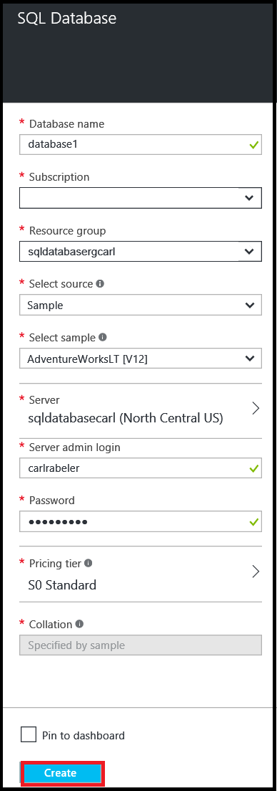

<!--
includes/sql-database-create-new-database-portal.md

Latest Freshness check:  2016-04-11 , carlrab.

As of circa 2016-04-11, the following topics might include this include:
articles/sql-database/sql-database-get-started-tutorial.md

-->
## 建立新的 Azure SQL 資料庫

Azure 入口網站中使用下列步驟，為新的 Azure SQL 資料庫伺服器上建立新的或現有 Azure SQL 資料庫邏輯。

1. 如果您目前並未連線，連線至[Azure 入口網站](http://portal.azure.com)。
2. 按一下 [**新增**]，輸入**SQL 資料庫**，再按一下 [ **SQL 資料庫 （新的資料庫）**。

     

3. 按一下 [ **SQL 資料庫 （新的資料庫）**。

     

4. 按一下 [**建立**]，建立新的資料庫中的 SQL 資料庫服務]。

     

5. 提供下列伺服器屬性的值︰

 - 資料庫名稱
 - 訂閱︰ 此才會套用您有多個訂閱。
 - 資源群組︰ 如果您才剛開始，使用 [資源] 群組中的邏輯伺服器。
 - 選取來源︰ 您可以選擇 [空白資料庫、 範例資料或 Azure 資料庫備份。 若要移轉的內部部署的 SQL Server 資料庫或使用 BCP 命令列工具載入資料，請參閱本文結尾的連結。
 - 伺服器︰ 新的或現有邏輯伺服器。
 - 伺服器管理員登入
 - 密碼
 - 定價層︰ 如果您才剛開始，使用預設值 S0。
 - 定序︰ 此才會套用所選 [空白資料庫]。

        

6.  按一下 [**建立**]。 在通知區域中，您可以看到部署已經啟動。

     

7. 部署完成，才能繼續進行下一個步驟，請等候。

     
