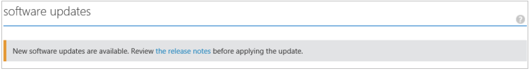

<!--author=SharS last changed: 01/15/2016-->

#### 從 Azure 傳統入口網站安裝更新 1.2

1. 在 [StorSimple 服務] 頁面中，選取您的裝置。 瀏覽至**裝置** > **進行的維修作業**。

2. 在頁面底部，按一下 [**掃描的更新**]。 瀏覽可用的更新，將會建立工作。 工作已順利完成時，您會收到通知。

3. 在相同頁面上的 [**軟體更新**] 區段中，您會看到有可用的軟體更新。 我們建議您在裝置上套用更新 1.2 之前檢閱版本資訊。

    

4. 在頁面底部，按一下 [**安裝更新**]。

5. 系統會提示您確認。 按一下**[確定]**。

6. **安裝更新**] 對話方塊就會顯示。 您的裝置必須符合檢查項目列在這個對話方塊。 之前更新已完成這些步驟。 選取 [**我瞭解上述的需求，我準備好更新我的裝置**]。 按一下 [檢查] 圖示。

    

7. 一組自動測試檢查就會立即開始。 這些功能包括︰

    - 若要確認裝置控制器健全和線上的 [**控制站狀況檢查**]。
    
    - [**硬體元件的狀況檢查**]，確認健全 StorSimple 裝置上的硬體元件。
    
    - 若要確認資料 0 已啟用您的裝置上的 [**資料 0 檢查**]。 如果未啟用此介面，您必須啟用它，然後再試一次。
    
    - 確認未啟用資料 2 和 3 的資料的網路介面的 [**資料 2 和 3 的資料會檢查**]。 如果有啟用這些介面，您會需要並停用它們，然後嘗試更新您的裝置。 這項檢查會執行，只有當您要從裝置執行 GA 軟體更新。 這項檢查不需要執行版本 0.1、 0.2 或 0.3 裝置。
    
    - 在任何裝置執行更新 1 之前版本上，**核取 [閘道器**。 這項檢查會在執行更新前 1 軟體的所有裝置上執行，但無法有設定網路介面資料 0 以外的閘道器的裝置上。
 
    如果上述所有的更新前檢查順利完成，僅會套用更新 1.2。 您將會收到更新前檢查正在進行中。
  
    

    以下是升級前的核取失敗 」 的範例。 您必須確認裝置控制器健康和線上。 您也必須檢查硬體元件的狀況。 在此範例中，控制器 0 與 1 控制器元件需要注意。 您可能需要連絡 Microsoft 支援服務，如果您無法自行解決這些問題。

     

    > [AZURE.NOTE] 您已套用更新 1.2 StorSimple 裝置上之後，請檢查資料 2 和 3 的資料和閘道器檢查就不會出現所需的未來的更新。 仍會需要其他測試檢查項目。

8. 順利完成升級前的檢查項目後，將會建立更新工作。 更新作業成功建立時，您會收到通知。
 
    

    更新就會套用在您的裝置上。
 
9. 若要監視更新工作的進度，請按一下 [**檢視工作**]。 在 [**工作**] 頁面中，您可以看到更新進度。 

    

10. 更新會需要幾個小時，才能完成。 您可以隨時檢視工作詳細的資料。

    

11. 完成工作之後，請瀏覽至**進行的維修作業**] 頁面，然後向下**軟體更新**捲動。

12. 確認您的裝置正在執行**StorSimple 8000 數列更新 1.2 (6.3.9600.17584)**。 **上次更新日期**應該也會將修改。

    ![進行的維修作業] 頁面](./media/storsimple-install-update-via-portal/InstallUpdate12_10M.png)

13. 現在，您會看到有可用的維護模式更新。 這些更新的破壞的更新，導致裝置停機時間，並僅透過您的裝置的 Windows PowerShell 介面會套用。 遵循指示進行[安裝進行的維修作業模式更新](storsimple-update-device.md#install-maintenance-mode-updates-via-windows-powershell-for-storsimple)為 StorSimple 安裝透過 Windows PowerShell 的更新。

> [AZURE.NOTE] 在某些情況下，表示有可用的維護模式更新可能會顯示訊息設定為 24 小時後進行的維修作業模式更新成功就會套用在裝置上。  

